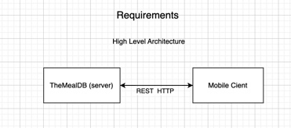
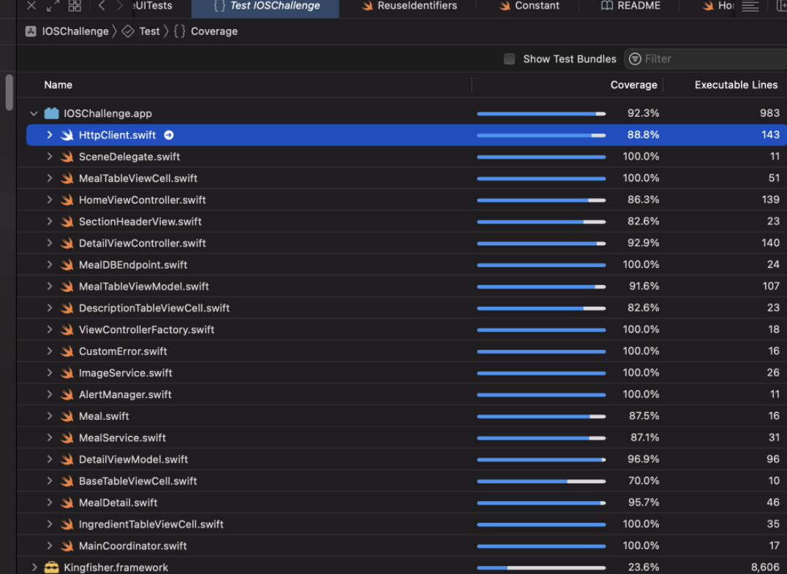

# IOSChallenge 🎸💻🏃‍♀️

<h2>Instruction</h2>
    
    CocoaPods: pod install
    
<h2>Support</h2>

    IOS 15 (the current version minus 1)
    Xcode 14.0
       
<h2>Features:</h2>

        Prefetch
        Portrait/Landscape
        Caching

<h2>High Level Architecture</h2>

    Since this is a small app, our mobile client only needs to communicate with the 
    backend server to retrieve the meal data. There are no other components such as 
    caching or messaging queue services.
    

<h2>High Level client Design</h2>

    To achieve modular design, I have used layers to organize modules, making it easier 
    to test and reuse them. One of the benefits is the ability to easily swap the UI layer 
    from UIKit to SwiftUI. These layers are abstracted by protocols to reduce component coupling, 
    and Dependency Injection (DI) is used to manage dependencies.
    

<h2>UI Architecture</h2>

    Even though this is a small app and the MVC architecture is sufficient for its current needs, 
    it would become challenging to scale, maintain, and test as we add more features and have 
    multiple teams working on the same app. Imagine a scenario where view controllers are responsible 
    for layout, networking, event handling, and data formatting. In such cases, these components would 
    become tightly coupled with the view controllers.
    
    To adhere to the software design principle of separation of concerns, I have decided to 
    adopt the MVVM architecture with delegate/protocol as the communication mechanism. 
    Introducing additional communication mechanisms such as RxSwift, Combine, or KVO would 
    add an extra layer of complexity to the project and make it difficult for developers 
    without relevant experience with these frameworks to understand.
  
<h2>UI Design</h2>

    Storyboards offer certain benefits, especially when working with tight project deadlines. However, 
    they can be challenging to maintain, and the build time can also increase.
    Swift UI: backward support 
    So in this project, I have created all the layouts programmatically using UIKit.
 
<h2>Navigation Design</h2> 

    I used coordinator pattern to handle navigation and flow between viewcontrollers. 
    
    1.Coordinator pattern: provides a central place to enhance navigation management. ✓
    2.Coorinator/Flow controlelrs: each view controller is assigned the responsibility of 
                presenting or dismissing other view controllers as required. coupling issue: X
    3.View Model-based Navigation: need to use rxswift, combine, callback, coupling issue X
    4.Storyboard Segues and Storyboard References: we are doing UI programmatically X

<h2>Storage</h2>

    For this app, I didn't store the list of meals after the first launch. 
    Since the remote server can update the items, we need to ensure that we 
    have up-to-date meals. One way to improve the initial loading is by adding a 
    layer of local cache (Core Data) between our app and the remote server. Our app 
    can then fetch the meals from the cache and cache will remain in sync with the remote server.

<h2>Cache</h2>

    NSCache requires manual implementation of caching logic, such as retrieving, storing, 
    and removing images. Therefore, I opted to use Kingfisher, which provides a comprehensive 
    set of features and optimizations for image caching. These include memory caching, disk caching, 
    prefetching, and various caching control strategies.

<h2>Networking</h2>

    prefetch images
    retry with delay
        Error recovery (client side): the user may have temporary network issues 
        Reduce load on server: the server might be overwhelmed by the amount of requests. In this case, 
        we want to make sure that the system will not be thrashed by the users hitting “refresh” every couple 
        of seconds. Instead, we want to spread out the time between retries.
    infinite scrolling: cancel requests if necessary 
    
<h2>Error handling</h2>

    Alert with error description
    

<h2>Testing</h2>

    Unit testing: 92%
        device Testing: simulatie slow networking condition: edge, 3g, LTE
    UI testing
        device Testing: different devices size testing 
        adapt to landscape and portrait for deailview
    Performance Testing 
        remove the device cache every launch (kingfisher) 
        

    
<h2>Future Tasks</h2>

    Pull refresh
    Transition to combine/Rxswift + MVVM + Rxflow to avoid heavy use of protocols/delegates/closures to expose states
    Localizaiton 
    Logging: Centrialized Logging service instead of using print statement 
    UI improvements
    Pagination: since the API doesn't provide pagination support for querying a list of meal and the 
        list is reasonably small, fetching it all at once should not be a problem.
    Separate layers to modules/framework with use of Facade Pattern for reusability to support cross-functional-teams
    Avoide using thrid party libary like kingfisher and create a custom cache module 

    
    
    
    

